# MCP Test Plan Generator - System Architecture

This diagram shows the technical architecture and component relationships of the MCP Test Plan Generator system.

```mermaid
graph TB
    subgraph "🖥️ Client Layer"
        Client["📱 FastMCP Client<br/>(client.py)"]
        ClientCheck["🔍 Input File Checker"]
    end
    
    subgraph "🔗 MCP Protocol Layer"
        MCPServer["⚡ FastMCP Server<br/>(test_plan_generator.py)"]
        Tool["🛠️ generate_test_plan Tool"]
    end
    
    subgraph "📂 File Processing Layer"
        Preprocess["📋 Preprocessor<br/>(preprocess.py)"]
        URLFetcher["🌐 URL Fetcher<br/>(url_fetcher.py)"]
        Validation["✅ Validator<br/>(validation.py)"]
    end
    
    subgraph "📁 Input Sources"
        InputDir["📁 input/ Directory"]
        TxtFiles["📝 .txt files"]
        JsonFiles["📋 .json files"]
        DocFiles["📄 .doc/.docx files"]
        URLsFile["🔗 urls.txt"]
        WebContent["🌐 External Websites"]
    end
    
    subgraph "🤖 AI Processing"
        GROQ["🧠 GROQ LLM<br/>(llama3-70b-8192)"]
        Prompt["📝 Detailed Prompt<br/>• Test Structure<br/>• Professional Format<br/>• Comprehensive Coverage"]
    end
    
    subgraph "📤 Output Layer"
        OutputDir["📁 output/ Directory"]
        TestPlan["📋 test_plan.md"]
        Response["📤 JSON Response"]
    end
    
    Client --> ClientCheck
    ClientCheck --> MCPServer
    MCPServer --> Tool
    Tool --> Preprocess
    
    Preprocess --> InputDir
    InputDir --> TxtFiles
    InputDir --> JsonFiles
    InputDir --> DocFiles
    InputDir --> URLsFile
    
    URLsFile --> URLFetcher
    URLFetcher --> WebContent
    WebContent --> URLFetcher
    
    TxtFiles --> Preprocess
    JsonFiles --> Preprocess
    DocFiles --> Preprocess
    URLFetcher --> Preprocess
    
    Preprocess --> Prompt
    Prompt --> GROQ
    GROQ --> Validation
    
    Validation --> OutputDir
    OutputDir --> TestPlan
    Validation --> Response
    Response --> Client
    
    style Client fill:#e1f5fe
    style GROQ fill:#f3e5f5
    style TestPlan fill:#e8f5e8
    style URLFetcher fill:#fff3e0
    style WebContent fill:#fff3e0
```



## Component Description

### **🖥️ Client Layer**
- **FastMCP Client**: Main client interface for connecting to the MCP server
- **Input File Checker**: Validates input directory and file existence

### **🔗 MCP Protocol Layer**
- **FastMCP Server**: Core MCP server implementation
- **generate_test_plan Tool**: Main tool that orchestrates test plan generation

### **📂 File Processing Layer**
- **Preprocessor**: Handles reading and processing different file formats
- **URL Fetcher**: Extracts and fetches content from web URLs
- **Validator**: Ensures generated test plans meet quality standards

### **📁 Input Sources**
- Support for multiple file formats: .txt, .json, .md, .doc, .docx, .pdf
- Special `urls.txt` file for specifying URLs to fetch content from
- External website content integration

### **🤖 AI Processing**
- **GROQ LLM**: Uses llama3-70b-8192 model for test plan generation
- **Professional Prompting**: Detailed prompts ensuring comprehensive coverage

### **📤 Output Layer**
- **Structured Output**: Saves test plans as markdown files
- **JSON Response**: Returns structured response to client

## How to Use This Diagram

1. **Copy the code above** (between the ```mermaid tags)
2. **Paste it into**:
   - [Mermaid Live Editor](https://mermaid.live/)
   - GitHub/GitLab README files
   - VS Code with Mermaid extension
   - Confluence, Notion, or other tools supporting Mermaid

3. **Export Options**:
   - PNG/SVG for documentation
   - PDF for reports
   - HTML for web pages 