# MCP Test Plan Generator - Process Flow

This diagram shows the complete process flow of how the MCP Test Plan Generator works from client request to final output.

```mermaid
flowchart TD
    A["🚀 Client Starts"] --> B["🔗 Connect to MCP Server"]
    B --> C["📞 Call generate_test_plan Tool"]
    C --> D["📁 Check Input Directory Exists"]
    
    D --> E{"📄 Files Found?"}
    E -->|No| F["❌ Return Error:<br/>No files found"]
    E -->|Yes| G["📖 Read All Input Files"]
    
    G --> H["📝 Process Text Files<br/>(.txt, .md)"]
    G --> I["📋 Process JSON Files<br/>(.json)"]
    G --> J["📄 Process Documents<br/>(.doc, .docx, .pdf)"]
    
    H --> K["🔗 Check for urls.txt"]
    I --> K
    J --> K
    
    K --> L{"🌐 URLs Found?"}
    L -->|No| M["ℹ️  No URLs to fetch"]
    L -->|Yes| N["🌐 Extract URLs from urls.txt"]
    
    N --> O["🔍 Validate URLs"]
    O --> P["📡 Fetch Content from URLs<br/>(with retries)"]
    P --> Q["🧹 Clean & Extract Text<br/>(using BeautifulSoup)"]
    Q --> R["✂️ Truncate if too long<br/>(max 5000 chars per URL)"]
    
    M --> S["🔄 Combine All Content"]
    R --> S
    
    S --> T["✂️ Check Content Length<br/>(max 15000 chars total)"]
    T --> U["🤖 Send to GROQ LLM<br/>(llama3-70b-8192)"]
    
    U --> V["📋 Generate Detailed Prompt<br/>• Executive Summary<br/>• Test Objectives<br/>• Test Cases with IDs<br/>• Risk Assessment<br/>• Entry/Exit Criteria"]
    
    V --> W["🎯 LLM Generates<br/>Professional Test Plan"]
    W --> X["✅ Validate Test Plan<br/>• Check length<br/>• Check structure<br/>• Check content quality"]
    
    X --> Y{"📊 Valid?"}
    Y -->|No| Z["❌ Return Validation Error"]
    Y -->|Yes| AA["📁 Create Output Directory"]
    
    AA --> BB["💾 Save to output/test_plan.md"]
    BB --> CC["📤 Return Success Response<br/>• Test plan content<br/>• Output file path<br/>• Validation results"]
    
    CC --> DD["🎉 Client Receives<br/>Complete Test Plan"]
    
    style A fill:#e1f5fe
    style DD fill:#e8f5e8
    style F fill:#ffebee
    style Z fill:#ffebee
    style U fill:#f3e5f5
    style W fill:#e8f5e8
```



## How to Use This Diagram

1. **Copy the code above** (between the ```mermaid tags)
2. **Paste it into**:
   - [Mermaid Live Editor](https://mermaid.live/)
   - GitHub/GitLab README files
   - VS Code with Mermaid extension
   - Any Mermaid-supported tool

3. **Export as**:
   - PNG image
   - SVG vector
   - PDF document
   - HTML page 